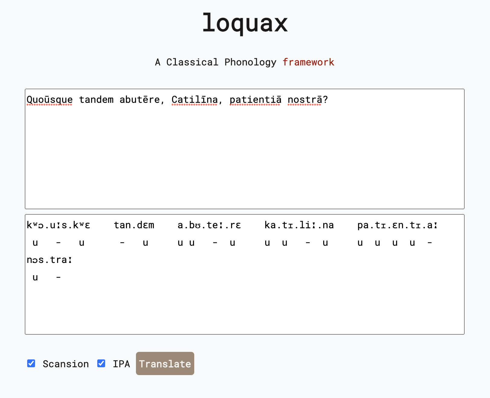

<h1 align="center">loquax</h1>
<p align="center">
</p>
<p align="center">A <i><a href="https://en.wikipedia.org/wiki/Classical_antiquity" target="_blank">Classical</a></i> Phonology framework</p>
<p align="center">
  <a href="https://github.com/psf/black"></a>
  <a href="https://codecov.io/gh/mattlianje/loquax" >
    
  </a>
   
</p>

<p align="center">
Loquax, (Latin for "chatty"), is an <b><i>extensible</i></b> Python library for analyzing and manipulating phonology. With hobbyists and academia in mind, it provides functionality for:
</p>
<p align="center">
... 
</p>

- [**Syllabification**](#syllabification) Break down words into their fundamental phonetic components.
- [**Phoneme Analysis:**](#phoneme-analysis) Understand the unique sounds and their roles within words.
- [**Morphological Transformations:**](#morphological-transformations) Observe and manipulate the structure of words.
- [**IPA Transliteration:**](#ipa-transliteration) Convert text into the International Phonetic Alphabet for universal comprehension.
- [**Scansion:**](#scansion) Analyze the rhythm of verse in classical poetry, and syllable weight in general.
- [**Extensibility:**](#extensibility) Build and customize your own language rules for unique or theoretical languages.

<p align="center">
... 
</p>
<p align="center">
Its a zero-dependency framework, with functional style Python 3.10+ features to revive the sounds of the past, one phoneme at a time.
</p>

#### Try It Out Now: Loquax Latin Online

To see `loquax` in action without diving into code, visit 
[Loquax Latin Online](https://mattlianje.pythonanywhere.com/). This web application uses `loquax` under the hood.
On the Loquax Latin Online, you can perform real-time Latin syllabification, IPA transcription, and scansion.

<p align="center">
<a href="https://mattlianje.pythonanywhere.com/">
  
</a>
</p>

#### Quickstart
```shell
pip install loquax
``` 

```python
from loquax import Document
from loquax.languages import Latin

catilinarian_orations = Document("Quoūsque tandem abutēre, Catilīna, patientiā nostrā?", Latin)
print(catilinarian_orations.to_string(ipa=True, scansion=True))

# outputs:
# kʷɔ.uːs.kʷɛ    tan.dɛm    a.bʊ.teː.rɛ    ka.tɪ.liː.na    pa.tɪ.ɛn.tɪ.aː    nɔs.traː
#  u   -   u      -   u     u u   -  u     u  u   -  u     u  u  u  u  -      u   -

```
#### Syllabification & Tokenization {#syllabification}
```python
print(catilinarian_orations.tokens)

# outputs:
# [kʷɔ.uːs.kʷɛ, tan.dɛm, a.bʊ.teː.rɛ, ka.tɪ.liː.na, pa.tɪ.ɛn.tɪ.aː, nɔs.traː]

print(catilinarian_orations.tokens[0].syllables)

# outputs:
# [quo, ūs, que]
```

#### Phoneme Analysis {#phoneme-analysis}
Understand unique sounds and their roles within words relative to a `Language`
```python
from loquax.abstractions import Phoneme
from loquax.languages import Latin

p = Phoneme('p', Latin)
print(p.is_consonant and p.is_liquid)  # outputs: True
```

#### Morphological Transformations {#morphological-transformations}
The central problem of phonology is that linguistic units have changing features depending on their context and neighbours. 

Loquax allows users to tackle this by defining their own morphisms. 

In this example, we create a `Morphism` that targets syllables with a nucleus and at least one coda, then transforms them into long syllables. 
The transformation is only applied if the next syllable has an onset of length greater than or equal to one. 
```python
from loquax.morphisms import Morphism, Rule, RuleSequence
from loquax.syllables import Syllable
from dataclasses import replace

long_position_morphism = Morphism[Syllable](
    target=Rule[Syllable](check_fn=lambda s: s.nucleus and s.coda and len(s.coda) >= 1),
    transformation=lambda s: replace(s, is_long=True),
    suffix=RuleSequence(
        [Rule[Syllable](check_fn=lambda s: s.coda and len(s.onset) >= 1)]
    ),
)
```
Once you've got a handle on individual morphisms, it's time to start collecting them! 
`MorphismStore` helps you to organize your morphisms in a neat and structured way.
```python
from loquax.abstractions import MorphismStore

# Assuming morphism1, morphism2, morphism3 are predefined Morphism objects...
morphism_store = MorphismStore([morphism1, morphism2, morphism3])
```
With a well-organized `MorphismStore`, applying transformations becomes a breeze. 

Make use of the `apply_all` method to apply all transformations in your MorphismStore to a given syllable or phoneme sequence, in the order they were added to the store.

This way, you can simulate a chain of transformations or even model complex linguistic phenomena with a single function call.
```python
# Consider we have a sequence of syllables...
syllables_sequence = [syllable1, syllable2, syllable3]

# Apply all transformations stored in MorphismStore
transformed_sequence = morphism_store.apply_all(syllables_sequence)

# transformed_sequence now holds the syllables transformed by morphism1, morphism2, morphism3 in order.
```

#### IPA Transliteration {#ipa-transliteration}
To convert text into the International Phonetic Alphabet for universal comprehension, 
you can use the `to_string` function with `ipa=True`:
```python
print(catilinarian_orations.to_string(ipa=True))

# outputs:
# kʷɔ.uːs.kʷɛ    tan.dɛm    a.bʊ.teː.rɛ    ka.tɪ.liː.na    pa.tɪ.ɛn.tɪ.aː    nɔs.traː
```

#### Scansion {#scansion}
Scansion is the process of marking the stresses in a poem, and dividing the lines into feet. 
It's a critical part of the study and enjoyment of classical verse, like in Latin and Ancient Greek poetry. 
Loquax makes it easy to integrate scansion into your language analysis pipeline.

Currently only differentiation between long and short syllables is made
```python
print(catilinarian_orations.to_string(scansion=True))

# outputs:
# quo.ūs.que    tan.dem    a.bu.tē.re    ca.ti.lī.na    pa.ti.en.ti.ā    nos.trā
#  u  -   u      -   u     u u  -  u     u  u  -  u     u  u  u  u  -     u   -
```

#### Extensibility {#extensibility}
Loquax allows for extensibility, so you can build and customize your own language rules 
for unique or theoretical languages. Here's an example of how to define custom rules and apply them:
```python
# Create your own custom language with unique rules and phonemes
from loquax.languages import Latin
from loquax.abstractions import (
    PhonemeSyllabificationRuleStore, Language, 
    Constants, Tokenizer, MorphismStore, 
    Syllable, Morphism, Phoneme
)

# Let's suppose we have defined custom syllabification rules and constants
custom_syllabification_rules = PhonemeSyllabificationRuleStore(...)
custom_constants = Constants(...)
custom_tokenizer = Tokenizer(...)
custom_syllable_morphisms = MorphismStore[Syllable]([...])
custom_phoneme_morphisms = MorphismStore[Phoneme]([...])

# Creation of our language object we can instantiate new `Documents` and other abstractions with
my_lang = Language(
    language_name='MyLang',
    iso_639_code='myl', # Made-up ISO 639 code for our custom language
    constants=custom_constants,
    syllabification_rules=custom_syllabification_rules,
    syllable_morphisms=custom_syllable_morphisms,
    phoneme_morphisms=custom_phoneme_morphisms,
    tokenizer=custom_tokenizer,
)

```

